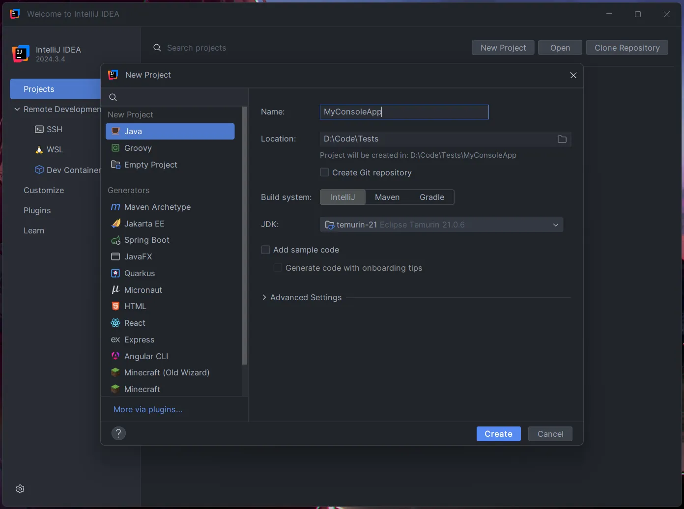
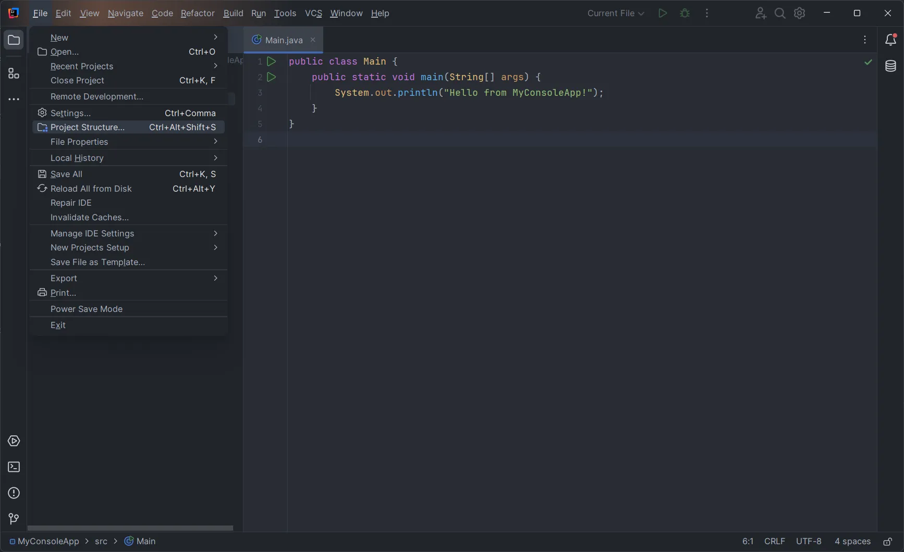
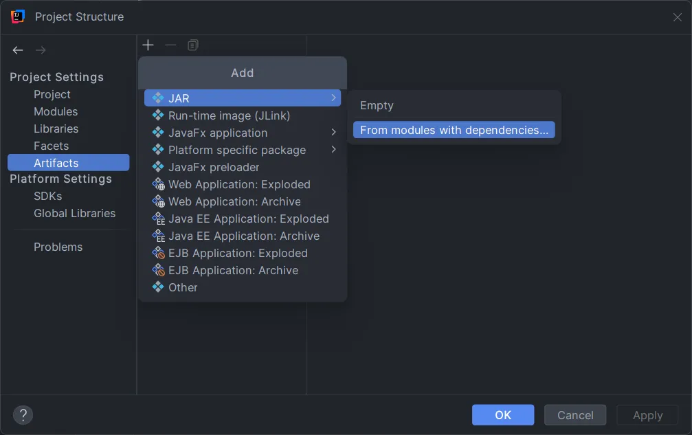
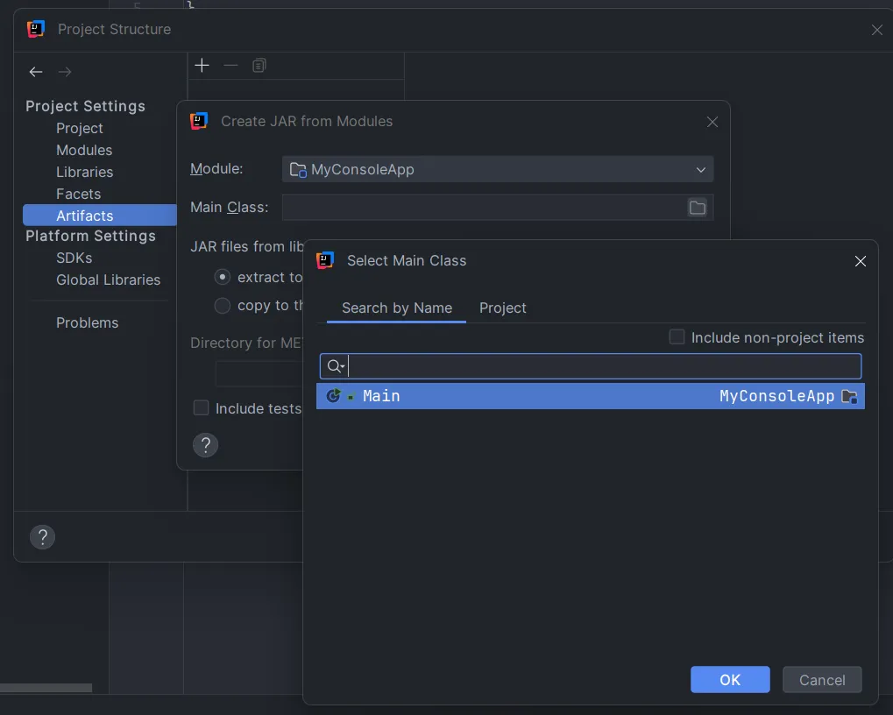

本文基于 IntelliJ IDEA 2024.3，使用 Launch4j 将一个 Java 控制台程序打包为 Windows 平台上的可执行文件 (.exe)。

## 准备项目



在 `src` 目录下新建 `Main.java`，写入以下内容：

```java
public class Main {
    public static void main(String[] args) {
        System.out.println("Hello from MyConsoleApp!");
    }
}
```

## 创建 JAR Artifact

点击左上角菜单栏，选择 **File - Project Structure**：



在 **Artifacts** 中，点击 + 号，选择 **JAR - From modules with dependencies...**



在 **Main Class** 一栏，点击右边的文件夹图标，找到程序中定义 `main` 方法的类，点击 OK 确认。



随后一路 OK 退出即可。

## 打包 JAR

随后打开菜单栏，点击 **Build - Build Artifacts**，在刚刚创建的 Artifact 上选择 **Build** 选项。

构建完成后，即可在项目 `out/artifacts` 目录下找到打包好的 .jar 文件。

## 使用 Launch4j 打包 exe

有了 .jar 文件后，就可以将其打包为可直接执行的 .exe 文件。

前往 [Launch4j 下载页面](https://sourceforge.net/projects/launch4j/)，点击 Download 下载安装程序，并安装。

打开 Launch4j，在 **Basic** 标签页中，填入：

- **Output file**：打包好的 .exe 文件存放路径
- **Jar**：刚刚输出的 .jar 文件路径

选择好之后，打开 **Header** 标签页，将 **Header type** 选择为 **Console**。

随后就可以点击上方的齿轮按钮进行打包了。点击后会提示保存一个存放 Launch4j 配置的 XML 文件，可以随便存在哪个地方。

窗口底部的 **Log** 部分现在会出现一些日志。等待到出现 *Successfully created...* 字样即为打包完成，后面跟的就是刚刚选择的 .exe 输出路径。

## 打包 Java 运行时

通过上面的步骤，一个可以直接运行的 .exe 文件已经成功地被构建出来了。但如果你将它移动到一个没有安装 Java 环境的系统中运行，就会发现有这样的提示：

```
This application requires a Java Runtime Environment.
```

我们知道，Java 程序依赖 Java 虚拟机（JVM）运行，即使使用 Launch4j 也不能避免这个问题。如果需要每一位用户都在自己电脑上安装 Java 才能运行我们编写的程序，未免还是太麻烦了。

幸运的是，Launch4j 让我们有办法连带 Java 运行环境一起打包。

回到 Launch4j 的主界面，在 **JRE** 标签页，将 **JRE paths** 中的内容替换为 `jre`，再次点击齿轮按钮重新打包。

随后我们需要下载一个 JRE 随程序一起分发。推荐使用 Eclipse Temurin（基于 OpenJDK），不需要登陆即可下载。

前往 [Eclipse Temurin 下载页面](https://adoptium.net/zh-CN/temurin/releases/)，下载 .zip 格式的 JRE。


下载下来解压到一个 `jre` 文件夹中，并把 `jre` 文件夹放在打包好的 .exe 旁边。

现在的目录结构应该是这样的：

```
(ROOT)
├── jre
│   ├── bin
│   ├── conf
│   ├── legal
│   ├── lib
│   ├── NOTICE
│   └── release
└── MyConsoleApp.exe
```

这样，程序运行时就会直接使用 `jre` 目录下的运行环境了。

::: tip 分发程序
这时就可以把 `jre` 目录连带 .exe 文件一起压缩成压缩包，传给别人使用了。需要注意 `jre` 目录一定需要在 .exe 文件同级。
:::
